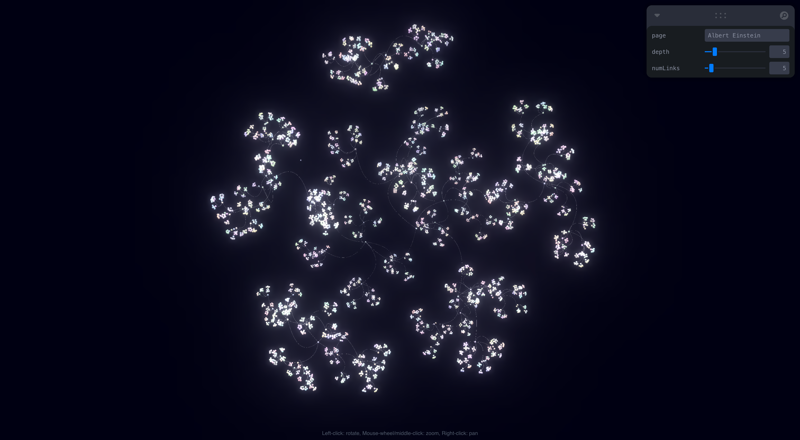

<div align="center">

  <h1>3D Wikipedia Graph</h1>
  
  <p>
  Visualize connections between wikipedia pages as froce directed graph
  </p>

  
<!-- Badges -->
<p>
  <a href="https://github.com/Louis3797/wikipedia-graph/graphs/contributors">
    
  </a>
  <a href="">
    
  </a>
  <a href="https://github.com/Louis3797/wikipedia-graph/network/members">
    
  </a>
  <a href="https://github.com/Louis3797/wikipedia-graph/stargazers">
    
  </a>
  <a href="https://github.com/Louis3797/wikipedia-graph/issues/">
    
  </a>
  <a href="https://github.com/Louis3797/wikipedia-graph/blob/master/LICENSE">
    
  </a>
</p>
   
<h4>
    <a href="https://github.com/Louis3797/wikipedia-graph/">View Demo</a>
  <span> · </span>
    <a href="https://github.com/Louis3797/wikipedia-graph">Documentation</a>
  <span> · </span>
    <a href="https://github.com/Louis3797/wikipedia-graph/issues/">Report Bug</a>
  <span> · </span>
    <a href="https://github.com/Louis3797/wikipedia-graph/issues/">Request Feature</a>
  </h4>
</div>

<br />


<!-- Table of Contents -->
# Table of Contents

- [Table of Contents](#table-of-contents)
  - [About the Project](#about-the-project)
    - [Features](#features)
    - [Tech Stack](#tech-stack)
  - [Getting Started](#getting-started)
    - [Prerequisites](#prerequisites)
    - [Installation](#installation)
    - [Run Locally](#run-locally)
  - [License](#license)
  - [Contact](#contact)

  

<!-- About the Project -->
## About the Project

<div align="center"> 
  
</div>

With this tool you can visualize the connections between Wikipedia pages. You can also specify how deep the search should go and how many connections should be taken per page. The result are incredibly nice looking graphs, as seen in the images above. Note that the program starts to slow down when the graph reaches a certain size, since the whole thing runs in the browser.

### Features

- Force Directed Graph
- 3D
- Zoom on Node when clicked
- Postprocessing
- Adjustable Depth
- Adjustable Connections per Vertex

### Tech Stack

- [Typescript](https://www.typescriptlang.org/)
- [React.js](https://reactjs.org/)
- [Three.js](https://threejs.org/)
- [React Three Fiber](https://docs.pmnd.rs/react-three-fiber/getting-started/introduction)
- [React Force Graph](https://github.com/vasturiano/react-force-graph)
- [Leva](https://github.com/pmndrs/leva)

<!-- Getting Started -->
## Getting Started

<!-- Prerequisites -->
### Prerequisites

This project uses Yarn as package manager

```bash
 npm install --global yarn
```

<!-- Installation -->
### Installation

Install wikipedia-graph with yarn

```bash
  yarn install wikipedia-graph
  cd my-project
```


<!-- Run Locally -->
### Run Locally

Clone the project

```bash
  git clone https://github.com/Louis3797/wikipedia-graph.git
```

Go to the project directory

```bash
  cd my-project
```

Install dependencies

```bash
  yarn install
```

Start the server

```bash
  yarn start
```

<!-- License -->
## License

Distributed under the MIT License. See LICENSE.txt for more information.


<!-- Contact -->
## Contact

Project Link: [https://github.com/Louis3797/wikipedia-graph](https://github.com/Louis3797/wikipedia-graph)